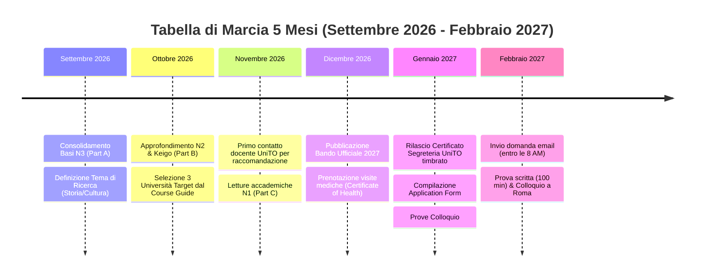

# 🇮🇹➡️🇯🇵 MEXT Japanese Studies Scholarship (Nikken-sei) — UniTO Roadmap 2027

**Target Program:** Japanese Studies Students (*Nihongo Nihonbunka Kenshū Ryūgakusei* / 日本語・日本文化研修留学生)  
**Target Intake:** Anno Fiscale 2027 (Partenza Autunno 2027)  
**Embassy:** Ambasciata del Giappone in Italia (Roma)  
**Candidate Profile:** Università degli Studi di Torino (UniTO) — *Corso di Laurea in Lingue e Culture dell'Asia e dell'Africa* (Classe L-11), 2º Anno (A.A. 2026/2027 appena iniziato a settembre)  
**Focus Fields:** Lingua, Cultura e Storia Giapponese  

---

## 1. 🎓 UniTO Academic Profile & Timeline 2026–2028

| Fase Temporale | Situazione Candidato UniTO | Stato & Azioni Chiave |
| :--- | :--- | :--- |
| **Settembre 2026** | Inizio del 2º anno a Torino (completato il 1º anno con successo). | ✅ Ha già maturato oltre 1 anno accademico di lingua/cultura giapponese. |
| **Febbraio 2027** | Invio candidatura & Prove di Selezione a Roma (test scritto + colloquio). | 🎯 Obiettivo operativo principale. Mancano circa 5 mesi di preparazione mirata. |
| **Luglio – Agosto 2027** | Esito definitivo MEXT Tokyo & Assegnazione Università giapponese. | Pratiche visto e biglietto aereo coperto dal MEXT. |
| **Ottobre 2027 – Settembre 2028** | 1 anno di studi in Giappone come Borsista del Governo Giapponese. | Frequenza corso, ricerca sul campo e stesura elaborato finale (*Shūryō Ronbun*). |
| **Autunno 2028** | Rientro a Torino per completare il 3º anno UniTO. | ⚠️ **Obbligo MEXT (*Return & Continue*):** Laurearsi a UniTO utilizzando la ricerca svolta in Giappone per la tesi triennale. |

---

## 2. 🗓️ Tabella di Marcia 5 Mesi (Settembre 2026 – Febbraio 2027)

---

## 3. 📑 Document Checklist & Istruzioni Specifiche UniTO

### Documenti da Inviare via Email (entro la scadenza di febbraio, max 10MB):
1. **Application Form (Modulo di Candidatura):**
   - Compilato in inglese o giapponese (preferibile digitato al computer).
   - Includere dettagliata motivazione accademica (*Field of Study and Study Plan*).
2. **Placement Preference Form (Scelta Università):**
   - Fino a 3 università selezionate dal *Course Guide of Japanese Studies Program*.
   - Distinzione tra:
     - **Corso Tipo (a):** Principalmente civiltà, cultura e storia giapponese (*Japan affairs & culture*).
     - **Corso Tipo (b):** Principalmente perfezionamento linguistico (*Japanese language proficiency*).
3. **Certified Academic Transcript & Certificate of Enrollment (Certificato di iscrizione con esami):**
   - ⚠️ **Attenzione UniTO:** L'autocertificazione scaricata da MyUniTO **NON è valida**.
   - Richiedere alla **Segreteria Studenti del Polo di Scienze Umanistiche** (Palazzo Nuovo / Complesso Aldo Moro) il *Certificato di iscrizione con esami sostenuti in carta resa legale (con marca da bollo se prevista o uso estero)*, munito di **timbro a inchiostro e firma originale del funzionario**.
   - Allegare traduzione giurata o ufficiale in inglese/giapponese approvata dal dipartimento.
4. **Recommendation Letter (Lettera di Raccomandazione):**
   - Redatta da un docente di giapponese o storia del Giappone di UniTO (es. Dipartimento di Studi Umanistici).
   - Deve essere stampata su **carta intestata ufficiale dell'Università di Torino**, con firma e timbro del docente.
5. **Certificate of Health (Certificato Medico):**
   - Modulo ufficiale MEXT compilato, timbrato e firmato da un medico abilitato.
   - Richiede: esami del sangue, delle urine, lastra al torace (Rx torace) e compilazione obbligatoria del punto 7 (*Physician's impression*).
   - *Nota Ambasciata:* Può essere consegnato in originale il giorno del test scritto a Roma se non pronto per l'email, ma va prenotato per tempo!
6. **Certificato JLPT (se conseguito negli ultimi 2 anni):**
   - Copia della pagina con punteggio dettagliato (Score Report).

---

## 4. 🏛️ Selezione Università Giapponesi (Placement Preference)

Per uno studente di UniTO con focus su **lingua, cultura e storia**:

| Università | Sede | Tipo Corso | Punti di Forza per Lingua / Cultura / Storia |
| :--- | :--- | :---: | :--- |
| **Tokyo University of Foreign Studies (TUFS / 東京外国語大学)** | Fuchu, Tokyo | (b) | Il polo linguistico più prestigioso del Giappone. Ideale per didattica avanzata della lingua e filologia. |
| **Kyoto University (京都大学)** | Kyoto | (a) | Eccellenza mondiale per storia giapponese, archeologia, letteratura classica e tradizioni culturali Kansai. |
| **Tohoku University (東北大学)** | Sendai, Miyagi | (a) | Programmi umanistici d'eccellenza in storia, filosofia e cultura giapponese antica/moderna. |
| **Osaka University (大阪大学)** | Suita/Toyonaka, Osaka | (a) | Grande tradizione in cultura urbana, dialettologia, storia moderna e teatro giapponese. |
| **Hokkaido University (北海道大学)** | Sapporo | (a)(b) | Offre sia approfondimento culturale/storico che intensivo linguistico in un campus storico. |
| **Kobe University (神戸大学)** | Kobe | (a)(b) | Ottimo equilibrio tra studi storici, interculturali e padronanza linguistica. |
| **Waseda University (早稲田大学)** | Shinjuku, Tokyo | (b) | Prestigiosa università privata con una delle biblioteche umanistiche più fornite del Giappone. |

---

## 5. ⚔️ Strategia per le Prove di Selezione

### A. Test Scritto (100 minuti — Ambasciata di Roma)
- **Part A (初級 - N3/N4):** Kanji fonetica e grafia, particelle (*wa, ga, ni, de, o, to, ya*), vocabolario di base nel contesto. *Obiettivo:* 100% di accuratezza per non perdere punti facili.
- **Part B (中級 - N2):** Verbi composti (*~dasu, ~komu, ~tsukusu*), connettori logici, forme passive/causative, e soprattutto **Keigo (敬語)**.
- **Part C (上級 - N1/N1+):** Espressioni formali scritte (*ni kakeru, o oite, to iedomo*), comprensione di saggi critici su società e cultura giapponese.

### B. Colloquio Orale (Pomeriggio a Roma)
- Riservato a chi supera la soglia dello scritto la mattina.
- Si svolge in **giapponese** (e parte in italiano).
- Commissione: funzionari diplomatici dell'Ambasciata del Giappone ed esperti accademici italiani.
- **Domande Cardine:**
  1. 自己紹介 (Presentazione personale accademica in giapponese formale).
  2. なぜトリノ大学で日本語・日本文化を専攻したか (Origine dell'interesse per il Giappone a UniTO).
  3. 日本での研究・研修計画 (Argomento specifico di studio: lingua, cultura o storia).
  4. なぜその希望大学を選んだか (Giustificazione motivata delle 3 scelte sul Placement Preference Form).
  5. 帰国後の展望 (Come gli studi a UniTO e la futura tesi beneficeranno di quest'anno in Giappone).
