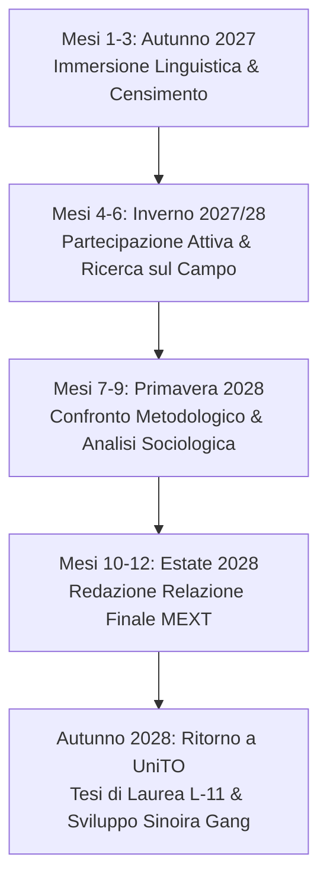

# Piano di Studio & Progetto di Ricerca MEXT 2027: Sociologia della Cultura Ludica e Comunità Giovanili

> **Candidato**: Studente 2º anno (2026/2027) — Università degli Studi di Torino (UniTO)  
> **Corso di Laurea**: L-11 Lingue e Culture dell'Asia e dell'Africa  
> **Target**: Borsa di Studio MEXT Japanese Studies (Nikken-sei) 2027 — Ambasciata del Giappone a Roma  
> **Progetto Locale di Riferimento**: Associazione Culturale e Ricreativa "Sinoira Gang" (Torino/Beinasco — Spazi Madiba e Comala)

---

## 1. Matrice di Conversione: Dalla Passione Reale al Valore Accademico MEXT

Nel modulo ufficiale MEXT (*Application Form - Field of Study and Study Program*) e nel colloquio orale d'Ambasciata, l'obiettivo non è nascondere la propria passione, ma **inquadrarla con rigore socioculturale ed etica di comunità**.

| Desiderio Autentico del Candidato | Inquadramento Accademico MEXT (Italiano) | Definizione Ufficiale in Giapponese (Modulo & Colloquio) |
| :--- | :--- | :--- |
| *«Voglio giocare a Pokemon Card Game e a Smash Ultimate con i giapponesi e stare con loro»* | **Analisi delle comunità ludiche come spazi di aggregazione e socializzazione giovanile nel Giappone contemporaneo**. Studio sul campo delle dinamiche di interazione tra pari (*peer-to-peer*) nei circoli amatoriali e nei negozi specializzati (*card shop* / カードショップ). | **「現代日本における若者のコミュニティ形成と対戦型アナログ・デジタルゲーム（ポケモンカードおよび対戦格闘ゲーム）の社会的役割に関する調査研究」** |
| *«Faccio parte della crew di Sinoira Gang a Torino (Pokémon TCG, Smash, giochi, inclusione per ragazzi)»* | **Esperienza diretta di cittadinanza attiva e progettazione associativa giovanile no-profit** volta all'abbattimento delle barriere economiche tramite il gioco intelligente; studio comparativo tra l'associazionismo piemontese e le reti territoriali giovanili giapponesi. | **「イタリア（トリノ）における若者主導の文化・遊戯団体設立の知見を基にした、日伊の青少年地域交流・非営利活動モデルの比較分析」** |
| *«Voglio studiare quello che devo studiare e dare una mano nelle faccende di casa»* | **Immersione quotidiana, etica della convivenza e partecipazione attiva al contesto comunitario locale** (*Kyōsei* 共生 / *Seikatsu Bunka* 生活文化). | **「地域社会・共同生活（生活文化・共生）への能動的参画と、実践的な日本語コミュニケーション能力の涵養」** |
| *«Tornare a Torino e creare una community solida»* | **Ritorno a UniTO al 3º anno, redazione della tesi di laurea e restituzione sociale sul territorio torinese** tramite le attività di "Sinoira Gang" (spazi Comala e Madiba). | **「帰国後のトリノ大学卒業論文への昇華、および地域コミュニティ（若者支援・多文化共生スペース）への実践的還元」** |

---

## 2. Dettaglio del Progetto di Studio (Study Plan / 研修計画)

### A. Titolo della Ricerca (Research Theme / 研修テーマ)
- **Italiano**: *Spazi di socializzazione e linguaggi condivisi: il ruolo del gioco di carte collezionabili e dei videogiochi comunitari nella costruzione del tessuto sociale giovanile in Giappone.*
- **Inglese**: *Shared Spaces and Play-Based Communication: The Role of Trading Card Games and Community Gaming in Contemporary Japanese Youth Socialization.*
- **Giapponese**: **「遊びを通じた現代日本の若者コミュニティと地域社会の空間的結合：TCG（トレーディングカードゲーム）とコミュニティ対戦ゲームを事例として」**

### B. Motivazione Accademica & Rilevanza (Background & Rationale)
1. **Il Gioco come Dispositivo di Comunicazione Interculturale**:
   A differenza della conversazione accademica formale, il gioco da tavolo strutturato (come il Pokémon TCG) e il videogioco comunitario (Super Smash Bros) possiedono un sistema di regole codificato a livello globale che azzera le inibizioni linguistiche. Permettono una comunicazione autentica, spontanea e ricca di registri colloquiali (*tameguchi* e gergo giovanile), mediata dalla cooperazione e dal rispetto reciproco (*rei* 礼).
2. **Il Card Shop e la Lega Territoriale come Terzo Luogo (*Third Place*)**:
   Nella sociologia urbana contemporanea (Ray Oldenburg), i giovani necessitano di "terzi luoghi" al di fuori della casa (*First Place*) e della scuola/università (*Second Place*). In Giappone, i *card shop* di quartiere, i tornei amatoriali e i ritrovi Smash fungono da presidi di aggregazione intergenerazionale sicuri e accessibili.
3. **Il Legame Diretto con Torino (Associazione "Sinoira Gang")**:
   Il candidato porta un'esperienza reale sul territorio torinese: l'attivazione dell'associazione culturale "Sinoira Gang" (Beinasco / Torino - poli Madiba e Comala), incentrata sul gioco sano, sull'inclusione gratuita e su laboratori artistici di riuso carta/cartone. Studiare in Giappone significa osservare la culla di questo fenomeno per importare buone pratiche di gestione comunitaria.

---

## 3. Piano Operativo nei 12 Mesi in Giappone (Milestones)

- **Fase 1 (Mesi 1–3 - Autunno 2027)**:
  - Consolidamento linguistico intensivo (corsi curriculari di ateneo su cultura e società).
  - Mappatura dei circoli ludici universitari (*Sākuru* サークル) e delle leghe Pokémon locali nel quartiere di residenza.
- **Fase 2 (Mesi 4–6 - Inverno 2027/2028)**:
  - Partecipazione settimanale alle serate di lega amatoriale (*Kōryūkai* 交流会) e tornei di comunità.
  - Raccolta dati qualitativa: interviste a giocatori e organizzatori sull'impatto del gioco nella prevenzione dell'isolamento giovanile.
- **Fase 3 (Mesi 7–9 - Primavera 2028)**:
  - Analisi delle pratiche di riciclo e gestione materiali cartacei nei tornei (collegamento con le finalità eco-artistiche dello Statuto Sinoira Gang).
  - Supervisione del professore tutor giapponese per l'impostazione metodologica della ricerca.
- **Fase 4 (Mesi 10–12 - Estate 2028)**:
  - Redazione del *Final Report* MEXT in lingua giapponese.
  - Presentazione orale dei risultati nel simposio conclusivo del programma Nikken-sei.

---

## 4. Selezione delle 3 Università (*Placement Preference Form — Pure Language Type (b)*)

Per questo programma di studio, la scelta è indirizzata esclusivamente al **Type (b)** (perfezionamento intensivo della lingua giapponese applicata), selezionando i poli universitari con la massima offerta didattica e il tessuto associativo metropolitano più fecondo per l'indagine sociologica:

1. **Prima Scelta: Waseda University (早稲田大学 - n. 61 del Catalogo)**
   - *Tipologia*: **Pure Type (b)** (Guida p. 177).
   - *Motivazione per la Commissione*: Massimo prestigio tra gli atenei privati giapponesi (Sōkei); eccellenza e flessibilità del *Center for Japanese Language* (CJL) con oltre 400 corsi modulari mirati al consolidamento linguistico e alla pragmatica della comunicazione.
   - *Motivazione per l'Indagine Sociologica*: Campus a Shinjuku/Takadanobaba, distretto urbano ad altissima densità giovanile e Terzi Luoghi (*Third Places*); osservatorio d'elezione per lo studio sul campo dei circoli universitari autogestiti (*sākuru*).
2. **Seconda Scelta: Tokyo University of Foreign Studies - TUFS (東京外国語大学 - n. 20 del Catalogo)**
   - *Tipologia*: **Type (b)** (Guida p. 56).
   - *Motivazione per la Commissione*: Polo governativo statale d'eccellenza per la didattica del giapponese come lingua straniera; programma interamente strutturato sulla transizione intensiva N3 $\rightarrow$ N2/N1.
   - *Motivazione per l'Indagine Sociologica*: Formazione specifica in mediazione interculturale applicata all'interazione tra studenti internazionali e comunità civile locale.
3. **Terza Scelta: Keio University (慶應義塾大学 - n. 57 del Catalogo)**
   - *Tipologia*: **Pure Type (b)** (Guida p. 166).
   - *Motivazione per la Commissione*: Storico *Japanese Language Program* (JLP) di Keio, attivo dal 1953; programma d'élite rigidamente organizzato per livelli (1-9) con lezioni giornaliere intensive di grammatica, esposizione orale e scrittura accademica.
   - *Motivazione per l'Indagine Sociologica*: Sede a Minato-ku (Tokyo), con una rete capillare di associazioni studentesche tra pari e progetti di scambio comunitario.
- *Riserva Accademica*: **Doshisha University (同志社大学 - n. 68 del Catalogo)**: Pure Type (b) (Guida p. 198), polo d'eccellenza privato nel Kansai (Kyoto) con programma accreditato di lingua pura presso il CJLC, ideale per il confronto comparativo tra l'associazionismo di Tokyo e quello del Kansai.

---

## 5. Risposte Modello per il Colloquio Orale d'Ambasciata (Roma)

### Domanda 1: なぜ日本で勉強したいですか？研究テーマは何ですか？
*(Perché vuole studiare in Giappone? Qual è il suo tema di studio?)*

> **Risposta Modello (Giapponese Formale / 敬語)**:
> 「トリノ大学でアジア・アフリカ言語文化学部で日本語と日本社会を専攻しております。私の研究テーマは、『現代日本における若者コミュニティの形成と、対戦型ゲーム（ポケモンカードゲームやコミュニティ対戦ゲーム）が果たす社会的・教育的役割』でございます。
> 現在、トリノにおきましても若者の孤立を防ぎ、誰もが無料で参加できる文化・遊戯団体『シノイラ・ギャング』の立ち上げに携わっております。日本におきまして、地域のカードショップや大学のサークル活動に実際に参加し、ルールある遊びがいかに世代や背景を超えた社会的なつながりを生み出しているかを実地で学びたいと考えております。」

### Domanda 2: 留学を終えて帰国した後、この経験をどう生かしますか？
*(Come utilizzerà questa esperienza dopo essere tornato in Italia?)*

> **Risposta Modello (Giapponese Formale / 敬語)**:
> 「帰国後は直ちにトリノ大学の3年次に復学し、日本で収集した実地調査の資料を基に卒業論文を執筆いたします。
> さらに、日本で学んだ健全なコミュニティ運営や異文化交流のノウハウを、トリノの若者向け文化スペース（マディバやコマラなど）での活動に還元し、日本文化と健全な遊びを通じた日伊の若者交流の架け橋となる活動を継続してまいります。」
