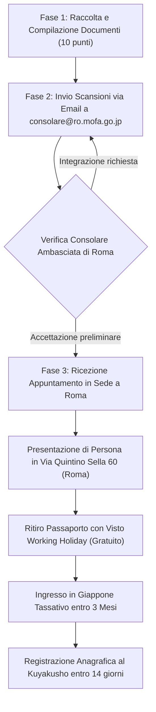

# Dossier di Ricerca: Visto Vacanza-Lavoro (Working Holiday Visa) Italia-Giappone

## 1. Quadro Normativo & Panoramica Ufficiale
- **Data di Entrata in Vigore**: 1 Aprile 2026 (Accordo bilaterale tra il Governo Italiano e il Governo Giapponese).
- **Fonte Ufficiale**: Ambasciata del Giappone in Italia — Ufficio Consolare ([it.emb-japan.go.jp](https://www.it.emb-japan.go.jp/itpr_it/visto_italiani_vacanza-lavoro.html)).
- **Finalità Istituzionale**: Promuovere la comprensione reciproca tra Italia e Giappone consentendo ai giovani di soggiornare fino a 1 anno principalmente per turismo e vacanza culturale, con facoltà di svolgere attività lavorativa accessoria (part-time) per integrare i costi del viaggio.
- **Divieto di Scopo Prevalentemente Lavorativo**: Il programma non è un visto di lavoro full-time ordinario; la motivazione principale dichiarata deve essere il soggiorno turistico/culturale.
- **Unicità del Rilascio ("Once in a Lifetime")**: Può essere concesso **una sola volta nella vita** a ciascun cittadino.

---

## 2. Requisiti di Eleggibilità & Profilo Candidato

| Parametro | Requisito Ufficiale Ambasciata | Verifica Profilo Patrik Potenza | Esito |
| :--- | :--- | :--- | :---: |
| **Cittadinanza** | Cittadino italiano | Cittadino italiano | Conforme |
| **Residenza** | Residente in Italia al momento della richiesta | Residente a Torino (TO), Italia | Conforme |
| **Fascia d'Età** | Tra 18 e 30 anni compiuti alla presentazione | Nato il 27/01/2002 (24 anni nel 2026) | Conforme (fino al 26/01/2033) |
| **Familiari al Seguito** | Nessun familiare a carico non avente titolo autonomo | Candidato singolo | Conforme |
| **Precedenti WHV** | Mai usufruito del visto Vacanza-Lavoro Giappone | Mai richiesto né ottenuto | Conforme |
| **Precedenti Penali** | Nessun precedente penale | Casellario giudiziale integro | Conforme |
| **Stato di Salute** | Buona salute generale | Certificabile | Conforme |

---

## 3. Costi, Fondi Finanziari & Copertura Sanitaria

### 3.1 Costo del Visto
- **Diritti Consolari di Rilascio**: **GRATUITO (€ 0,00)**.
- In virtù dell'accordo bilaterale di reciprocità, il rilascio del visto sul passaporto non prevede tasse consolari per i cittadini italiani.

### 3.2 Requisiti di Liquidità (Estratto Conto Bancario)
Il richiedente deve presentare gli estratti conto bancari degli ultimi 3 mesi intestati a proprio nome che dimostrino:
1. **Fondi per Viaggio di Ritorno**: Circa **€ 2.000** per il biglietto aereo di rientro (oppure prova di prenotazione del volo A/R già acquistato).
2. **Fondi di Sussistenza Iniziale**: Almeno **€ 1.800** per le spese di alloggio e prime necessità all'arrivo in Giappone.
3. **Totale Liquidità Consigliata**: Almeno **€ 3.800 - 4.000** di saldo attivo dimostrabile nell'ultimo trimestre (se non si è ancora acquistato il volo di rientro).

### 3.3 Copertura Sanitaria Obbligatoria
- **Iscrizione all'Assicurazione Sanitaria Nazionale Giapponese (*Kokumin Kenkō Hoken* - 国民健康保険)**:
  - Entro 14 giorni dall'arrivo in Giappone, registrazione anagrafica (*Jūminhyō*) presso l'ufficio municipale (*Kuyakusho* / *Shiyakusho*) di residenza e iscrizione obbligatoria.
  - Premio mensile: circa **3.500 JPY / mese** (~22 €/mese, variabile in base alla municipalità).
  - Copertura: **70% delle spese mediche e farmaceutiche** sul territorio giapponese (il 30% resta a carico dell'assicurato).
- **Assicurazione Integrativa Viaggio**:
  - Le voci escluse dal sistema nazionale (rimpatrio sanitario d'urgenza, infortunio, invalidità o responsabilità civile) devono essere coperte da polizza assicurativa privata stipulata prima della partenza.

---

## 4. Checklist dei 10 Documenti Richiesti

| N. | Documento Richiesto | Specifiche e Dettagli Operativi |
| :---: | :--- | :--- |
| **1** | **Passaporto Valido** | Almeno 2 pagine contigue libere. Validità residua: durata prevista soggiorno + 3 mesi (almeno 15 mesi per soggiorno di 1 anno). |
| **2** | **Modulo di Richiesta Visto** | *Visa Application Form* ufficiale con dati anagrafici e recapiti. |
| **3** | **Fototessera (1 copia)** | Formato ICAO, scattata entro 6 mesi. **Da incollare con colla** (Tassativo divieto di spille metalliche). |
| **4** | **Curriculum Vitae (CV)** | In inglese o giapponese con percorso scolastico, accademico e lavorativo. |
| **5** | **Schema Attività Previste** | Tabella cronologica indicativa dei luoghi di soggiorno previsti e attività culturali/lavorative ipotizzate. |
| **6** | **Dichiarazione di Intenti** | *Reason for Application* (formato libero, in inglese o giapponese): spiegazione del perché si desidera sperimentare la vita e cultura in Giappone. |
| **7** | **Estratto Conto Ultimi 3 Mesi** | Documento bancario ufficiale intestato al candidato attestante la liquidità minima (€ 3.800+). |
| **8** | **Prenotazione Biglietto Aereo** | Solo se già in possesso di volo A/R (altrimenti compensata dai fondi bancari). |
| **9** | **Dichiarazione Sanitaria** | Modulo d'impegno formale ad aderire al *Kokumin Kenkō Hoken* all'arrivo. |
| **10** | **Consenso Trattamento Dati** | Modulo standard di informativa privacy firmato. |

---

## 5. Procedura di Domanda (Step-by-Step)

1. **Invio Telematico Preliminare**:
   - Inviare la cartella completa dei documenti a `consolare@ro.mofa.go.jp`.
   - Oggetto dell'email: `[Nome Cognome] - Richiesta Visto Vacanza-Lavoro`.
2. **Appuntamento di Persona a Roma**:
   - Una volta confermata la correttezza della documentazione via email, l'Ufficio Consolare fissa la data dell'appuntamento.
   - Luogo: Ambasciata del Giappone in Italia, Via Quintino Sella 60, 00187 Roma.
3. **Tempistica di Rilascio e Partenza**:
   - Rilascio del passaporto con etichetta visto: indicativamente 5-7 giorni lavorativi.
   - **Finestra d'Ingresso**: Una volta emesso, il visto impone l'ingresso in Giappone **entro 3 mesi dalla data di emissione**.

---

## 6. Condizioni di Soggiorno & Vincoli sul Lavoro
- **Lavoro Accessorio Consentito**: Camerieri, baristi (non in locali notturni per adulti), commessi, receptionist d'albergo, insegnamento lingue, comparsate, collaborazioni digitali.
- **Divieto Assoluto Fūzoku**: È severamente proibito lavorare in qualsiasi esercizio regolamentato dalla legge sui divertimenti e morale pubblica (*Fūzoku Eigyō*): cabaret, host/hostess club, bar notturni per adulti, sale da gioco pachinko.
- **Permesso di Rientro Speciale (*Minaoshi Minashi Sainyūkoku*)**:
  - Il visto originale è a ingresso singolo, ma è possibile lasciare temporaneamente il Giappone e rientrare durante l'anno di validità compilando la cedola di rientro speciale in aeroporto (*Special Re-entry Permit*).

---

## 7. Analisi Strategica: Working Holiday vs Borsa MEXT Japanese Studies

### 7.1 Confronto Diretto dei Due Percorsi

| Parametro | Borsa MEXT Japanese Studies (Nikken-sei) | Visto Working Holiday |
| :--- | :--- | :--- |
| **Tipo di Titolo** | Borsa di studio ministeriale prestigiosa d'élite | Visto di soggiorno individuale per vacanza-lavoro |
| **Visto Emesso** | Visto Governativo **Student (留学 - Ryūgaku)** | Visto **Designated Activities (特定活動)** |
| **Copertura Economica** | **100% spesato**: 117.000 JPY/mese (~8.200 € totali) + Tasse azzerate + Volo A/R gratuito | **Autofinanziato**: Richiesti € 3.800+ propri all'ingresso; vitto e alloggio a proprio carico |
| **Università Destinataria** | Waseda (CJL), TUFS (JLC), Keio (JLP) | Nessuna iscrizione accademica automatica |
| **Riconoscimento CFU UniTO** | Pieno riconoscimento esami nel libretto L-11 | Nessun CFU accademico erogato |
| **Disponibilità Temporale** | Solo durante gli anni di iscrizione triennale L-11 | Attivabile in qualunque momento tra i 18 e i 30 anni |

### 7.2 Perché il Working Holiday NON Deve Essere Attivato Ora
1. **Preservazione dello Status di Primo Viaggio (MEXT Guideline Sec. 14)**:
   - Patrik Potenza ha 0 viaggi pregressi in Giappone. Questa condizione di prima esperienza diretta rappresenta un punto di forza nel dossier per borse di lingua e cultura giapponese.
2. **Requisito di Frequenza Continuativa a UniTO (Guideline Sec. 1.(9))**:
   - Per concorrere al bando MEXT di febbraio 2027, il candidato deve essere iscritto e frequentante al 2° anno del Corso di Laurea L-11 e garantire il rientro a UniTO per la tesi. Partire in Working Holiday interromperebbe la carriera o impedirebbe la verbalizzazione della sessione invernale a Torino.
3. **Mantenimento del "Jolly" Once in a Lifetime**:
   - Poiché il Working Holiday si può ottenere una sola volta, usarlo per un breve periodo prima della borsa significherebbe bruciarlo permanentemente.

### 7.3 Il Ruolo Perfetto: "Ultimate Plan B" & Post-Graduation Bridge
- **Piano di Emergenza Istituzionale**: Se a marzo 2027 la graduatoria dell'Ambasciata o le selezioni bilaterali UniTO non dovessero assegnare la borsa a Tokyo, il Working Holiday diventa la **rete di salvataggio definitiva**: permette di partire immediatamente nell'estate/autunno 2027 per svolgere lavoro sul campo sul Pokémon TCG e i Terzi Luoghi a Tokyo.
- **Opzione Post-Triennale**: Qualora si vinca la borsa MEXT per il 2027/2028 (con visto Ryūgaku), il Working Holiday rimarrà **100% integro e spendibile** nel 2028-2032 tra la laurea triennale e la magistrale o per una transizione lavorativa post-laurea.
